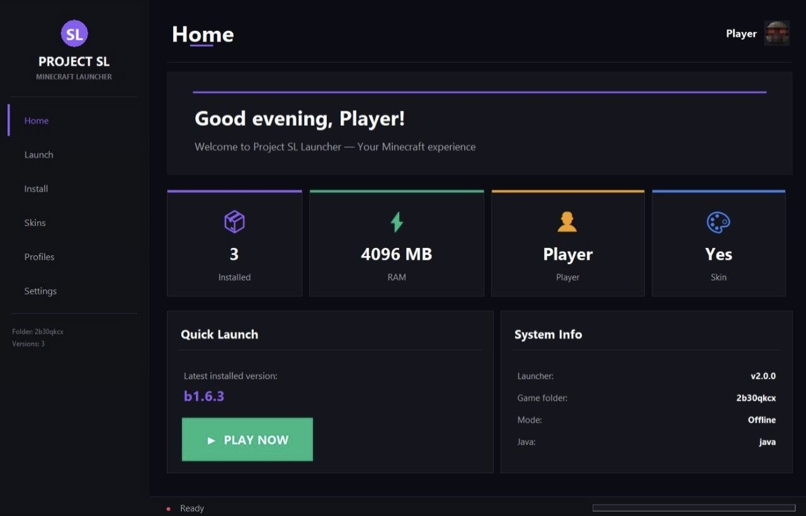

📥 Пошаговая инструкция по запуску

1. Скачайте релиз 📦
Перейдите по ссылке:
🔗 https://github.com/r53-alt/Project-SL/releases
Скачайте самый свежий релиз Project SL Launcher 

2. Создайте папку на рабочем столе 🖥️

3.Создайте новую папку 
Перенесите туда файл Project SL Launcher.py

4. Создайте специальную игровую папку 📁
В той же папке, где лежит скрипт, создайте папку с точным названием:
2b30qkcx
Это очень важно! Лаунчер использует именно эту папку как свою .minecraft 📂

5. Установите зависимости 🛠️
Откройте терминал в папке и выполните:
pip install -r requirements.txt
Или вручную:
pip install minecraft-launcher-lib Pillow requests
✅ Готово!

6. Запустите лаунчер 🔥
Откройте папку в Visual Studio Code
Откройте файл Project SL Launcher.py
Нажмите F5 или выберите "Run Python File in Terminal"
🎮 Лаунчер должен запуститься с красивым тёмным дизайном!
